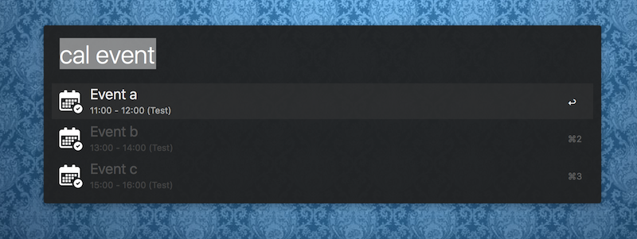

# Alfred Workflow for Calendar

Show todays events, using [icalBuddy](http://hasseg.org/icalBuddy/)

## Usage

- **cal** `<search>`

## Installation

- Download the `.alfredworkflow` file from the [latest version](https://github.com/josa42/alfred-calendar/releases/latest)
- Double click `.alfredworkflow` file to install the workflow

## Update

If there is an update available, an option to update the extension will show up.

## License

- [awgo](https://github.com/deanishe/awgo) ([MIT](https://github.com/deanishe/awgo/blob/master/LICENCE))
- [icalBuddy](http://hasseg.org/icalBuddy/) ([MIT](http://hasseg.org/stuff/license/MIT_License.txt))

[MIT © Josa Gesell](LICENSE)

